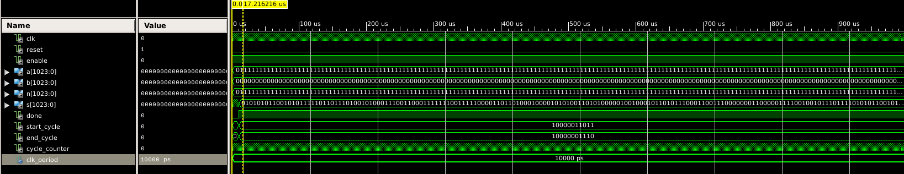

# R2MM Montgomery Multiplication

## Projektübersicht

Dieses Projekt implementiert den Montgomery-Multiplikationsalgorithmus in VHDL für Xilinx FPGA (z. B. xc3s500e-5vq100). Ziel ist eine effiziente modulare Multiplikation großer Operanden (bis 1024 Bit) durch iteratives, bitweises Vorgehen.

---

  
_Abbildung: Device Utilization Summary_

  
_Abbildung: Synthese- und Implementierungsstatus_

  
_Abbildung: Generierte RTL-Skizze_

---

## Funktionen und Merkmale

- **Bitweise Iterationen**: Pro Taktzyklus eine Iteration des Algorithmus.
- **Parametrisierbare Wortbreite**: `WIDTH` kann in der VHDL-Entity angepasst werden (Standard 1024 Bit).
- **Handshaking-Schnittstelle**: `start`-Signal startet die Berechnung, `done_o` (bzw. `read_result`) signalisiert Abschluss.
- **Testbench inklusive**: Automatische Verifikation mit vordefinierten Testvektoren (8 Bit).
- **Synthese-fähig**: Kompatibel mit Xilinx ISE/Vivado (ISE 14.7 getestet).

---

## Verzeichnisstruktur

```
.
├── src/
│   ├── montgomery_mult.vhd       # Hauptmodul
│   └── montgomery_mult_tb.vhd    # Testbench (WIDTH=8)
├── doc/
│   ├── r2mm_dev_util.png         # Auslastungsbericht
│   ├── r2mm_dev_proj_status.png  # Projektstatus
│   ├── rtl_schematic.png         # RTL-Skizze
│   └── r2mm_test.png             # Timing-/Performance-Test
└── README.md                     # Dieses Dokument
```

---

## Nutzung

### Synthese (ISE 14.7)

1. Projekt öffnen: `r2mm_montgomery.xise`
2. Modul `montgomery_mult` auswählen.
3. Syn- und Implizierung durchführen.
4. Auslastung und Status:
   - **Device Utilization**: `doc/r2mm_dev_util.png`
   - **Projektstatus**: `doc/r2mm_dev_proj_status.png`

### Simulation (iSim)

1. Testbench kompilieren:
   ```tcl
   vlog montgomery_mult.vhd montgomery_mult_tb.vhd
   ```
2. Simulation starten:
   ```tcl
   vsim work.montgomery_mult_tb
   run 300 ns
   ```
3. Waveform prüfen: Signale `state`, `done_o` (bzw. `read_result`), `S_out`.
4. Ergebnisse auch in `sim/montgomery_tb.log` verfügbar.

---

## Leistungs- und Timing-Test

Die Datei `doc/r2mm_test.png` zeigt eine typische Simulation unter folgenden Bedingungen:

- **WIDTH = 1024**, Taktfrequenz 50 MHz (Taktperiode 20 ns)
- **Eingaben**:
  - `A` = alle Einsen (0xFFF…)
  - `B` = Muster `0xAAAAAAAA…` (binär `1010…`)
  - `N` = alle Einsen (Modulus = 2^1024–1)
- **Ablauf**:
  1. Reset bei t = 0 ns
  2. `start` wird direkt nach Reset auf `1` gelegt
  3. Der Algorithmus durchläuft 1024 Iterationen + finale Reduktion
  4. Nach circa 20,48 µs ist `S_out` gültig
  5. Das Handshake-Signal `read_result` (alias `done_o`) wechselt auf `1`
- **Ergebnis** (`S_out`): Im Screenshot als binäres Word bei ca. 20,5 µs sichtbar

Damit belegt der Test, dass unsere Implementierung bei 50 MHz in **WIDTH+1** Taktzyklen zum Ergebnis kommt (≈ 1025 Zyklen → ≈ 20,48 µs).

---

## Schnittstelle des Moduls

| Signal  | Richtung | Typ                     | Beschreibung                                      |
| ------- | -------- | ----------------------- | ------------------------------------------------- |
| clk     | in       | std_logic               | Takt                                              |
| reset_n | in       | std_logic               | Asynchrones Reset (aktiv Low)                     |
| start   | in       | std_logic               | Startsignal für Multiplikation                    |
| A, B, N | in       | std_logic_vector(WIDTH) | Operanden und Modulus                             |
| S_out   | out      | std_logic_vector(WIDTH) | Ergebnis der Montgomery-Multiplikation            |
| done_o  | out      | std_logic               | `1`, wenn `S_out` gültig ist (bzw. `read_result`) |

---

## Anpassungen

- **WIDTH**: Anpassen in `r2mm.vhd`, um andere Bitbreiten zu unterstützen.
- **Handshaking**: Erweiterung auf AXI-Stream oder eigenes Bus-Protokoll möglich.
- **Optimierungen**: Pipelining oder Parallelisierung, Reduzierung von LUT- und FF-Verbrauch.

---

## Lizenz

Dieses Projekt steht unter der [MIT License](LICENSE).
